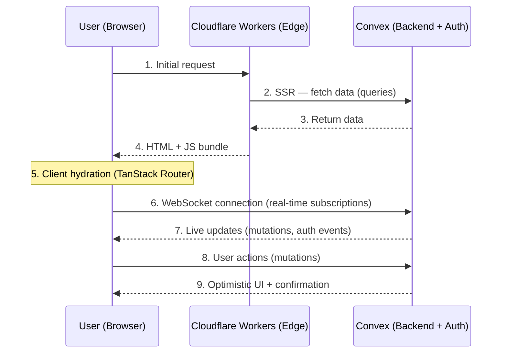

<div align="center">

# ⚡ convex-tanstack-cloudflare

**The real-time edge starter — TanStack Start + Convex + Better Auth + Cloudflare Workers.**

Real-time data sync, edge SSR, self-hosted auth, Terraform IaC, rate limiting, and RBAC — production-ready out of the box.

[](https://github.com/joealmond/convex-tanstack-better-auth-cloudflare-terraform/actions/workflows/ci.yml)
[](LICENSE)
[](CONTRIBUTING.md)
[](https://tanstack.com/start/latest)
[](https://convex.dev)
[](https://workers.cloudflare.com)

[Quick Start](#quick-start) · [Architecture](#architecture-flow) · [Deployment](#deployment) · [Docs](docs/README.md)

</div>

---

## Philosophy

This template embodies **opinionated simplicity**:

- **Real-time first**: Convex provides instant data sync without configuration
- **Edge-native**: Cloudflare Workers for global, low-latency deployment
- **Type-safe**: End-to-end TypeScript with Zod validation
- **Self-hostable**: Works with Convex Cloud or self-hosted Convex
- **Portable**: GitHub Actions support Cloudflare, Vercel, or Netlify

### Stack Choices

| Layer         | Choice             | Why                                           |
| ------------- | ------------------ | --------------------------------------------- |
| **Framework** | TanStack Start     | Modern React SSR with file-based routing      |
| **Database**  | Convex             | Real-time sync, serverless, TypeScript-native |
| **Auth**      | Better Auth        | Free, self-hosted, data ownership             |
| **Edge**      | Cloudflare Workers | Fast, cheap, global edge network              |
| **Styling**   | Tailwind CSS v4    | Utility-first, zero-runtime                   |
| **IaC**       | Terraform          | Declarative infrastructure                    |

### Architecture Flow



**Key Points:**

- **Steps 1-4**: Server-Side Rendering (SSR) on Cloudflare Workers for fast initial load
- **Steps 5-6**: Client-side hydration with TanStack Start and WebSocket connection to Convex
- **Steps 7-9**: Real-time data sync and mutations with optimistic UI updates
- **Auth**: Better Auth integrated with Convex for session management

---

## Quick Start

```bash
# 1. Clone & install
git clone https://github.com/joealmond/convex-tanstack-better-auth-cloudflare-terraform.git
cd convex-tanstack-better-auth-cloudflare-terraform
npm install

# 2. Configure Vite environment
cp .env.example .env.local
# Edit .env.local with your Convex URL

# 3. Set Convex backend environment variables
npx convex env set BETTER_AUTH_SECRET "$(openssl rand -base64 32)"
npx convex env set SITE_URL "https://your-project.convex.site"
npx convex env set GOOGLE_CLIENT_ID "your-google-client-id"
npx convex env set GOOGLE_CLIENT_SECRET "your-google-client-secret"

# 4. Start development (Convex + Vite concurrently)
npm run dev
```

Open [http://localhost:3000](http://localhost:3000)

### Available Scripts

| Script                    | Description                                |
| ------------------------- | ------------------------------------------ |
| `npm run dev`             | Start dev server (Vite + Convex)           |
| `npm run build`           | Build for production                       |
| `npm run preview`         | Preview production build with Wrangler     |
| `npm run typecheck`       | Run TypeScript checks                      |
| `npm run lint`            | Run ESLint                                 |
| `npm run generate:routes` | Regenerate TanStack Router route tree      |
| `npm run deploy:preview`  | Deploy to preview environment              |
| `npm run deploy:prod`     | Deploy to production                       |
| `npm run sync:wrangler-config` | Generate Wrangler deploy config from build |

---

## Configuration

### Environment Variables

| Variable               | Description                               |
| ---------------------- | ----------------------------------------- |
| `VITE_CONVEX_URL`      | Convex deployment URL (`.convex.cloud`)   |
| `VITE_CONVEX_SITE_URL` | Convex HTTP URL (`.convex.site`)          |
| `BETTER_AUTH_SECRET`   | Auth secret (`openssl rand -base64 32`)   |
| `GOOGLE_CLIENT_ID`     | Google OAuth client ID                    |
| `GOOGLE_CLIENT_SECRET` | Google OAuth secret                       |

### Cloudflare Workers

Key settings in `wrangler.jsonc`:

```jsonc
{
  "compatibility_flags": ["nodejs_compat"],
  "compatibility_date": "2025-01-01",
  "main": "@tanstack/react-start/server-entry",
}
```

---

## Deployment

### Local Deploy

```bash
./scripts/deploy.sh preview     # deploy preview (default)
./scripts/deploy.sh production  # deploy production
```

### GitHub Actions (Automatic)

Pushing to `main` triggers CI. On success, the Deploy workflow auto-deploys to **preview**.

To deploy to **production**, manually trigger the Deploy workflow with `environment=production`.

**Required GitHub Secrets** (for Cloudflare):

| Secret                   | Description                              |
| ------------------------ | ---------------------------------------- |
| `CLOUDFLARE_API_TOKEN`   | Cloudflare API token (Workers Edit)      |
| `CLOUDFLARE_ACCOUNT_ID`  | Cloudflare account ID                    |
| `VITE_CONVEX_URL`        | Convex URL for preview builds            |
| `VITE_CONVEX_SITE_URL`   | Convex site URL for preview builds       |
| `CONVEX_DEPLOY_KEY`      | Convex deploy key (shared or per-env)    |

See [docs/PUBLIC_PREVIEW_CHECKLIST.md](docs/PUBLIC_PREVIEW_CHECKLIST.md) for the full bootstrap guide.

**Optional Repository Variables:**

| Variable         | Options                           | Default      |
| ---------------- | --------------------------------- | ------------ |
| `DEPLOY_TARGET`  | `cloudflare`, `vercel`, `netlify` | `cloudflare` |
| `CONVEX_HOSTING` | `cloud`, `self-hosted`            | `cloud`      |

### Terraform (Infrastructure)

```bash
cd infrastructure
cp terraform.tfvars.example terraform.tfvars
terraform init && terraform apply
```

---

## Project Structure

```
├── convex/             # Backend (queries, mutations, auth)
├── src/routes/         # Frontend pages
├── src/lib/            # Utilities (auth, env, utils)
├── infrastructure/     # Terraform IaC
├── docs/               # Extended documentation
└── scripts/            # Deploy scripts
```

---

## Documentation

| Topic                    | Link                                                                               |
| ------------------------ | ---------------------------------------------------------------------------------- |
| **Architecture Guide**   | [docs/ARCHITECTURE.md](docs/ARCHITECTURE.md)                                       |
| **Preview Checklist** ⚡ | [docs/PUBLIC_PREVIEW_CHECKLIST.md](docs/PUBLIC_PREVIEW_CHECKLIST.md)               |
| **Production Checklist** | [docs/PRODUCTION_DEPLOYMENT_CHECKLIST.md](docs/PRODUCTION_DEPLOYMENT_CHECKLIST.md) |
| **Rate Limiting** ⚡     | [docs/RATE_LIMITING.md](docs/RATE_LIMITING.md)                                     |
| **RBAC & Permissions**   | [docs/RBAC.md](docs/RBAC.md)                                                       |
| **Mobile (Capacitor)**   | [docs/MOBILE.md](docs/MOBILE.md)                                                   |

⚡ = Production-ready implementations included

**📚 [Full docs index →](docs/README.md)** — deployment targets, payments, email, AI, CI/CD options, and more.

### External Docs

- [TanStack Start](https://tanstack.com/start/latest)
- [Convex](https://docs.convex.dev)
- [Cloudflare Workers](https://developers.cloudflare.com/workers/)
- [Better Auth](https://www.better-auth.com/docs)
- [Tailwind CSS](https://tailwindcss.com/docs)
- [Terraform](https://developer.hashicorp.com/terraform/docs)
- [TypeScript](https://www.typescriptlang.org/docs/)
- [React](https://react.dev)

---

## Troubleshooting

| Issue                    | Solution                                                                   |
| ------------------------ | -------------------------------------------------------------------------- |
| Convex types missing     | Run `npx convex login` then `npx convex dev`                               |
| Workers build fails      | Check `nodejs_compat` in `wrangler.jsonc`                                  |
| Auth not persisting      | Verify `SITE_URL` matches your app URL                                     |
| Missing env vars warning | Set Convex env vars: `npx convex env set SITE_URL "url"`                   |
| Route types invalid      | Run `npm run generate:routes` to regenerate route tree                     |
| CORS errors on auth      | Check `trustedOrigins` in `convex/auth.ts`                                 |
| SSR QueryClient error    | Verify `ConvexProvider` and `QueryClientProvider` are in `router.tsx` Wrap |

---

## Credits

This template was inspired by:

- [srinivas-gangji/tanstack-convex-template](https://github.com/srinivas-gangji/tanstack-convex-template) - Production patterns and vite config

Co-authored with AI assistance powered by [Claude](https://anthropic.com/claude) (Anthropic).

---

## License

MIT
