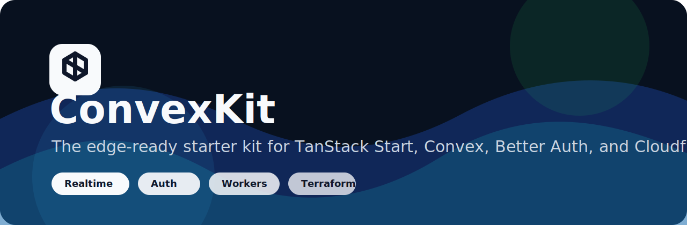
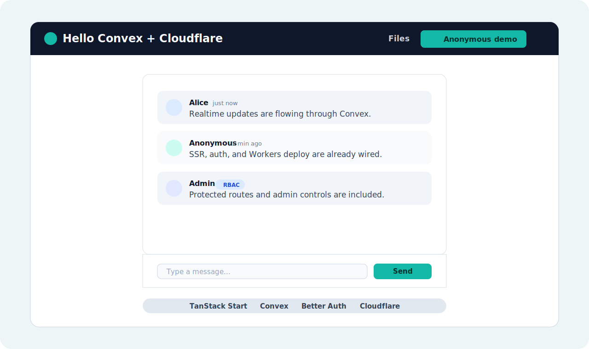
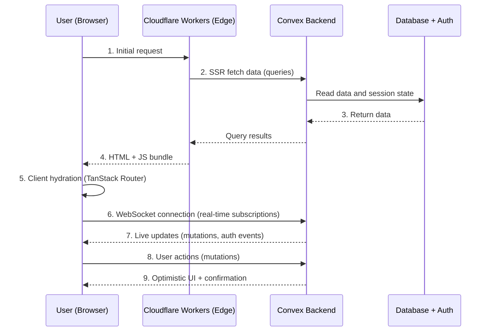

# ConvexKit

The edge-ready starter kit for TanStack Start, Convex, Better Auth, and Cloudflare Workers.



[](LICENSE)
[](https://github.com/joealmond/convex-tanstack-better-auth-cloudflare-terraform/actions/workflows/ci.yml)
[](CONTRIBUTING.md)


**[Open the live demo](https://convexkit-preview.jozsef-mandula.workers.dev)** · [Read the docs](https://joealmond.github.io/convex-tanstack-better-auth-cloudflare-terraform/)

```bash
npm create convexkit@latest my-app
cd my-app
npm run setup
npm run dev
```



## Philosophy

This template embodies **opinionated simplicity**:

- **Real-time first**: Convex provides instant data sync without configuration
- **Edge-native**: Cloudflare Workers for global, low-latency deployment
- **Type-safe**: End-to-end TypeScript with Zod validation
- **Self-hostable**: Works with Convex Cloud or self-hosted Convex
- **Portable**: the scaffolder generates Cloudflare, Vercel, or Netlify deployment output

### Stack Choices

| Layer         | Choice             | Why                                           |
| ------------- | ------------------ | --------------------------------------------- |
| **Framework** | TanStack Start     | Modern React SSR with file-based routing      |
| **Database**  | Convex             | Real-time sync, serverless, TypeScript-native |
| **Auth**      | Better Auth        | Free, self-hosted, data ownership             |
| **Edge**      | Cloudflare Workers | Fast, cheap, global edge network              |
| **Styling**   | Tailwind CSS v4    | Utility-first, zero-runtime                   |
| **IaC**       | Terraform          | Declarative infrastructure                    |

### Architecture Flow



**Key Points:**

- **Steps 1-4**: Server-Side Rendering (SSR) on Cloudflare Workers for fast initial load
- **Steps 5-6**: Client-side hydration with TanStack Start and WebSocket connection to Convex
- **Steps 7-9**: Real-time data sync and mutations with optimistic UI updates
- **Auth**: Better Auth integrated with Convex for session management

---

## Quick Start

```bash
# 1. Compose a project
npm create convexkit@latest my-app
cd my-app

# 2. Configure Convex and authentication
npm run setup

# 3. Start development (Convex + Vite concurrently)
npm run dev
```

Open [http://localhost:3000](http://localhost:3000)

The interactive generator lets you choose Better Auth or Clerk; Cloudflare Workers, Vercel, or
Netlify; any combination of the included examples; and optional Terraform. For automation, run
`npm create convexkit@latest -- --help` to see non-interactive flags.

Prefer cloud dev? See [Codespaces and devcontainers](docs/CODESPACES.md).
Explore the included examples at [http://localhost:3000/examples](http://localhost:3000/examples),
including realtime chat at [http://localhost:3000/examples/chat](http://localhost:3000/examples/chat).

### Available Scripts

| Script                         | Description                                            |
| ------------------------------ | ------------------------------------------------------ |
| `npm run dev`                  | Start dev server (Vite + Convex)                       |
| `npm run setup`                | Create `.env.local` and optionally set Convex env vars |
| `npm run build`                | Build for production                                   |
| `npm run preview`              | Preview production build with Wrangler                 |
| `npm run typecheck`            | Run TypeScript checks                                  |
| `npm run lint`                 | Run ESLint                                             |
| `npm run test:coverage`        | Run unit tests with enforced coverage thresholds       |
| `npm run test:e2e:public`      | Run public Playwright smoke tests                      |
| `npm run docs:dev`             | Start the VitePress documentation site                 |
| `npm run generate:routes`      | Regenerate TanStack Router route tree                  |
| `npm run deploy:preview`       | Deploy to preview environment                          |
| `npm run deploy:prod`          | Deploy to production                                   |
| `npm run sync:wrangler-config` | Generate Wrangler deploy config from build             |

---

## Configuration

### Environment Variables

| Variable                   | Description                                       |
| -------------------------- | ------------------------------------------------- |
| `VITE_CONVEX_URL`          | Convex deployment URL (`.convex.cloud`)           |
| `VITE_CONVEX_SITE_URL`     | Convex HTTP URL (`.convex.site`)                  |
| `VITE_GOOGLE_AUTH_ENABLED` | Show Google OAuth sign-in UI (`false` by default) |
| `BETTER_AUTH_SECRET`       | Auth secret (`openssl rand -base64 32`)           |
| `GOOGLE_CLIENT_ID`         | Optional Google OAuth client ID                   |
| `GOOGLE_CLIENT_SECRET`     | Optional Google OAuth secret                      |

### Cloudflare Workers

Key settings in `wrangler.jsonc`:

```jsonc
{
  "compatibility_flags": ["nodejs_compat"],
  "compatibility_date": "2026-07-13",
  "main": "@tanstack/react-start/server-entry",
}
```

---

## Deployment

### Local Deploy

```bash
./scripts/deploy.sh preview     # deploy preview (default)
./scripts/deploy.sh production  # deploy production
```

### GitHub Actions (Automatic)

Pushing to `main` triggers CI. On success, the Deploy workflow auto-deploys to **preview** when the repository variable `AUTO_DEPLOY_ENABLED` is set to `true`. This opt-in prevents fresh template copies from failing CI before deployment secrets exist.

To deploy to **production**, manually trigger the Deploy workflow with `environment=production`.

**Required GitHub Secrets** (for Cloudflare):

| Secret                         | Description                            |
| ------------------------------ | -------------------------------------- |
| `CLOUDFLARE_API_TOKEN`         | Cloudflare API token (Workers Edit)    |
| `CLOUDFLARE_ACCOUNT_ID`        | Cloudflare account ID                  |
| `VITE_CONVEX_URL_PREVIEW`      | Convex URL for preview builds          |
| `VITE_CONVEX_SITE_URL_PREVIEW` | Convex HTTP-actions URL for preview    |
| `CONVEX_DEPLOY_KEY_PREVIEW`    | Preview Convex deploy key              |
| `VITE_CONVEX_URL_PROD`         | Convex URL for production builds       |
| `VITE_CONVEX_SITE_URL_PROD`    | Convex HTTP-actions URL for production |
| `CONVEX_DEPLOY_KEY_PROD`       | Production Convex deploy key           |

See [docs/PUBLIC_PREVIEW_CHECKLIST.md](docs/PUBLIC_PREVIEW_CHECKLIST.md) for the full bootstrap guide.

**Optional Repository Variables:**

| Variable                           | Options                | Default |
| ---------------------------------- | ---------------------- | ------- |
| `AUTO_DEPLOY_ENABLED`              | `true`, `false`        | `false` |
| `CONVEX_HOSTING`                   | `cloud`, `self-hosted` | `cloud` |
| `CLOUDFLARE_CUSTOM_DOMAIN_PREVIEW` | Preview hostname       | unset   |
| `CLOUDFLARE_CUSTOM_DOMAIN_PROD`    | Production hostname    | unset   |

After adding the secrets, set `AUTO_DEPLOY_ENABLED=true` to enable preview deployments after successful pushes to `main`.

### Terraform (Infrastructure)

```bash
cd infrastructure
cp terraform.tfvars.example terraform.tfvars
terraform init && terraform apply
```

Terraform provisions only optional account-level services. Wrangler owns and deploys the Worker and its Custom Domain.

---

## Project Structure

```
├── convex/             # Backend (queries, mutations, auth)
├── src/routes/         # Frontend pages
├── src/lib/            # Utilities (auth, env, utils)
├── infrastructure/     # Terraform IaC
├── packages/           # create-convexkit npm scaffolder
├── docs/               # Extended documentation
└── scripts/            # Deploy scripts
```

---

## Documentation

| Topic                    | Link                                                                               |
| ------------------------ | ---------------------------------------------------------------------------------- |
| **Docs Site**            | [VitePress source](docs/index.md)                                                  |
| **Architecture Guide**   | [docs/ARCHITECTURE.md](docs/ARCHITECTURE.md)                                       |
| **Preview Checklist** ⚡ | [docs/PUBLIC_PREVIEW_CHECKLIST.md](docs/PUBLIC_PREVIEW_CHECKLIST.md)               |
| **Production Checklist** | [docs/PRODUCTION_DEPLOYMENT_CHECKLIST.md](docs/PRODUCTION_DEPLOYMENT_CHECKLIST.md) |
| **Rate Limiting** ⚡     | [docs/RATE_LIMITING.md](docs/RATE_LIMITING.md)                                     |
| **Feature Guides**       | [docs/README.md#features](docs/README.md#features)                                 |
| **Troubleshooting**      | [docs/TROUBLESHOOTING.md](docs/TROUBLESHOOTING.md)                                 |
| **RBAC & Permissions**   | [docs/RBAC.md](docs/RBAC.md)                                                       |
| **Mobile (Capacitor)**   | [docs/MOBILE.md](docs/MOBILE.md)                                                   |

⚡ = Production-ready implementations included

**📚 [Full docs index →](docs/README.md)** — deployment targets, payments, email, AI, CI/CD options, and more.

### External Docs

- [TanStack Start](https://tanstack.com/start/latest)
- [Convex](https://docs.convex.dev)
- [Cloudflare Workers](https://developers.cloudflare.com/workers/)
- [Better Auth](https://www.better-auth.com/docs)
- [Tailwind CSS](https://tailwindcss.com/docs)
- [Terraform](https://developer.hashicorp.com/terraform/docs)
- [TypeScript](https://www.typescriptlang.org/docs/)
- [React](https://react.dev)

---

## Troubleshooting

| Issue                    | Solution                                                                              |
| ------------------------ | ------------------------------------------------------------------------------------- |
| Dependencies missing     | Run `npm install` or `npm ci`; see [docs/TROUBLESHOOTING.md](docs/TROUBLESHOOTING.md) |
| Convex types missing     | Run `npx convex login` then `npx convex dev`                                          |
| Workers build fails      | Check `nodejs_compat` in `wrangler.jsonc`                                             |
| Auth not persisting      | Verify `SITE_URL` matches your app URL                                                |
| Missing env vars warning | Set Convex env vars: `npx convex env set SITE_URL "url"`                              |
| Route types invalid      | Run `npm run generate:routes` to regenerate route tree                                |
| CORS errors on auth      | Check `trustedOrigins` in `convex/auth.ts`                                            |
| SSR QueryClient error    | Verify `ConvexProvider` and `QueryClientProvider` are in `router.tsx` Wrap            |

---

## Credits

This template was inspired by:

- [srinivas-gangji/tanstack-convex-template](https://github.com/srinivas-gangji/tanstack-convex-template) - Production patterns and vite config

Co-authored with AI assistance powered by [Claude](https://anthropic.com/claude) (Anthropic).

---

## License

MIT
